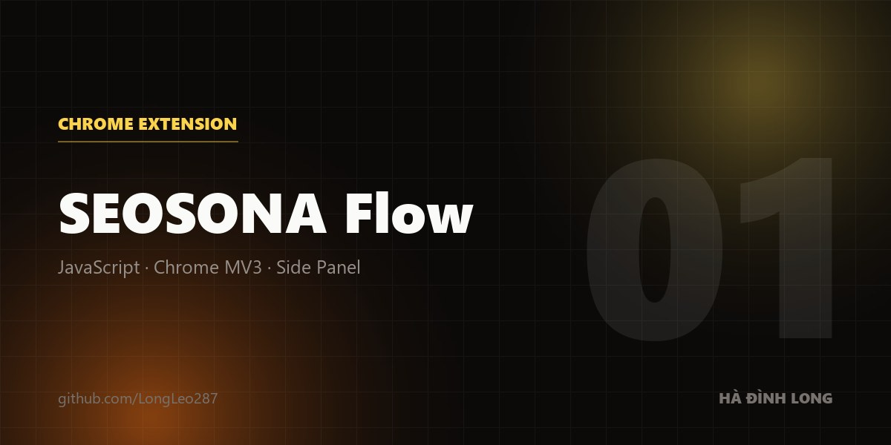

<div align="center">



# SEOSONA Flow

**Dựng ảnh và video AI theo quy trình — ngay trong Chrome, không máy chủ, không tài khoản.**

[](https://seosona-flow.vercel.app)


</div>

---

## Nó giải quyết chuyện gì

Bạn cần 30 ảnh sản phẩm cùng một phong cách. Hoặc 12 cảnh video cho một quảng cáo.

Làm tay trên Google Flow nghĩa là: dán prompt → đợi → tải → đổi tên → lặp lại 30 lần. Và đến ảnh thứ 15 thì phong cách đã trôi đi đâu mất.

SEOSONA Flow biến việc đó thành **một luồng bạn vẽ ra rồi bấm chạy**:

```
Prompt ──▶ Tạo ảnh ──▶ Cổng chất lượng ──┬──▶ Tải về (đã xoá watermark, sạch metadata)
              ▲                          │
              │                          └──▶ Tạo lại nếu rớt
        Ảnh tham chiếu
     (giữ nhân vật nhất quán)
```

Nó **lái trình duyệt của bạn** trên chính tài khoản bạn đang đăng nhập. Không API key, không hạn mức riêng, không có máy chủ nào của chúng tôi đứng giữa.

---

## Điểm đáng chú ý

<table>
<tr>
<td width="50%" valign="top">

### 🎬 Workflow kiểu n8n

Kéo thả node trên canvas. 18 loại node: tạo ảnh/video, prompt tự sinh, bung biến thể, điều kiện, vòng lặp, cổng chất lượng, tải về, Telegram.

**30 mẫu dựng sẵn** — mở là chạy.

</td>
<td width="50%" valign="top">

### 🧹 Xoá watermark có căn cứ

Hồ sơ alpha **đo từ 624 khung video thật** (Omni Flash + Veo, cả ngang lẫn dọc), không phải ước lượng bằng mắt.

Kiểm bằng vùng đối chứng: sau khi xoá, phép đo **không phân biệt được** với vùng chưa từng có watermark.

</td>
</tr>
<tr>
<td valign="top">

### 🛡️ Dọn metadata riêng tư

Gỡ **toạ độ GPS**, số sê-ri máy, tên tác giả, đường dẫn máy, và **prompt** mà nhiều công cụ AI nhét kèm file.

Ảnh cắt ở tầng container → **không nén lại, không mất chất lượng**. Video ghi đè tại chỗ → không lệch bảng offset.

</td>
<td valign="top">

### 📚 Kho prompt 323 mẫu

Phân nhóm theo ngách, kèm kỹ thuật tham chiếu. Có node tự sinh prompt và bung biến thể từ một ý.

Chống "AI slop": cấm cụm sáo rỗng, ép **danh từ · chất liệu · ánh sáng · ống kính** cụ thể.

</td>
</tr>
</table>

---

## Cài trong 60 giây

```bash
git clone https://github.com/LongLeo287/seosona-flow.git
```

| | |
|---|---|
| **1** | Mở `chrome://extensions` |
| **2** | Bật **Developer mode** (góc trên bên phải) |
| **3** | Bấm **Load unpacked** |
| **4** | Chọn thư mục **`seosona-flow/`** ← *không phải thư mục gốc repo* |
| **5** | Bấm icon extension → bảng điều khiển mở bên phải |

Không có bước build. Mã nguồn nạp thẳng, thư viện đã vendor sẵn trong `lib/`.

### Cần gì thêm?

Đúng **hai** thứ, và bạn đã có cả hai:

- **Google Chrome** (hoặc trình duyệt nhân Chromium có Manifest V3 + Side Panel)
- **Tài khoản của chính bạn** ở dịch vụ bạn định dùng — `labs.google/fx`, `chatgpt.com`, `gemini.google.com`, `grok.com`. Đăng nhập sẵn là được.

| | |
|---|---|
| Máy chủ / backend | ❌ Không — chạy 100% offline |
| Tài khoản SEOSONA | ❌ Không — không đăng nhập, không gói cước |
| `npm install` | ❌ Không — chỉ cần khi chạy bộ test |
| API key trả phí | ❌ Không — dùng phiên đăng nhập sẵn của bạn |
| Bước build | ❌ Không |

> Extension **không kèm tài khoản hay API key nào**. Mỗi lần chạy tiêu credit của chính tài khoản bạn. Chưa đăng nhập thì tab Gen và Image-to-Prompt sẽ không hoạt động.

---

## Bên trong có gì

| Khu vực | Nội dung |
|---|---|
| 🎨 **Gen** | Tạo hàng loạt, hàng đợi tự thử lại, tải tự động 1080p |
| 🗂️ **Spaces** | Workflow của bạn · mẫu dựng sẵn · luồng đang chạy |
| 💬 **Prompts** | 323 prompt phân nhóm, tìm kiếm, sửa và lưu bản riêng |
| ⚙️ **Tasks** | Nhiều tác vụ song song, theo dõi từng cái |
| 🧰 **Tools** | Xoá watermark · Dọn metadata · Chữ vector lên ảnh · Góc camera · Hiệu ứng · Neo phong cách · AI Agent (MCP) · Telegram |

### Kiến trúc

```
seosona-flow/
├── src/core/          engine: watermark · metadata · executor · hàng đợi
├── src/workflow/      canvas, node, trình sửa workflow
├── src/prompts/       tab Gen + kho prompt
├── content_scripts/   lái trang provider (Flow · ChatGPT · Grok · Gemini)
├── pages/             side panel + các cửa sổ công cụ
├── assets/            prompt pack · mẫu workflow · icon
├── lib/               thư viện vendor (không cần cài)
└── tests/             139 bộ test
```

---

## Chất lượng

Không phải khẩu hiệu — đây là thứ chạy trước mỗi lần commit:

```bash
cd seosona-flow && npm run verify
```

15 tầng: `static` · `budgets` · `lint` · `security` · `audit` · `architecture` · `workflows` · `providers` · `privacy` · `ux` · `release` · `readiness` · `test:audit` · `test:unit` · `test:integration`

Một số chỉ số bị khoá bằng **trần có ratchet** — chỉ được giảm, không được tăng: `emptyCatch: 0` · số lời gọi `console` · số biến toàn cục · số file quá khổ. Nới trần bắt buộc kèm lý do trong commit.

---

## Ranh giới — đọc trước khi dùng

> [!IMPORTANT]
> **Không gỡ được nhãn "nội dung do AI tạo".**
> Google nhúng **SynthID vào pixel**, không phải metadata. Xoá metadata hay watermark nhìn thấy đều **không đụng** được tới nó. Facebook, Instagram, TikTok vẫn nhận ra ảnh/video là AI. Công cụ ở đây dọn thứ lộ về **bạn** — vị trí, thiết bị, danh tính, prompt.

> [!NOTE]
> **Chỉ dùng cho nội dung của chính bạn.**
> Phần xoá watermark nhắm vào ảnh/video **bạn tự tạo** bằng tài khoản của bạn. Không hỗ trợ và không nên dùng cho ảnh kho bản quyền.

> [!WARNING]
> **Extension lái trình duyệt thật của bạn.**
> Nó bấm nút, điền form, tải file trên tài khoản bạn đang đăng nhập. Chạy quá nhanh hoặc quá nhiều có thể khiến nhà cung cấp giới hạn tốc độ. Đã có sẵn bộ giới hạn tốc độ và cầu dao ngắt, nhưng hãy dùng chừng mực.

---

## Quyền riêng tư

Extension xin quyền `<all_urls>` để phục vụ Image-to-Prompt (chuột phải lên ảnh ở bất kỳ trang nào) và tải tự động.

**Không dữ liệu nào rời khỏi máy bạn**: không telemetry, không backend, không gọi API bên thứ ba nào ngoài chính các tab AI mà bạn đã đăng nhập. Toàn bộ config, lịch sử, kho prompt nằm trong `chrome.storage` + IndexedDB.

---

## Đóng góp

```bash
cd seosona-flow
npm install
npm run verify     # phải xanh cả 15 tầng
```

Quy ước ở [`AGENTS.md`](AGENTS.md). Ngắn gọn: commit viết **vì sao**, không chỉ **cái gì**; không thêm trailer đồng tác giả cho AI.

---

<div align="center">

**[▶ Trang giới thiệu](https://seosona-flow.vercel.app)** · [Tài liệu extension](seosona-flow/README.md) · [Báo lỗi](https://github.com/LongLeo287/seosona-flow/issues)

<sub>100% offline · Không thu thập dữ liệu · Không tài khoản · Không API key</sub>

</div>
